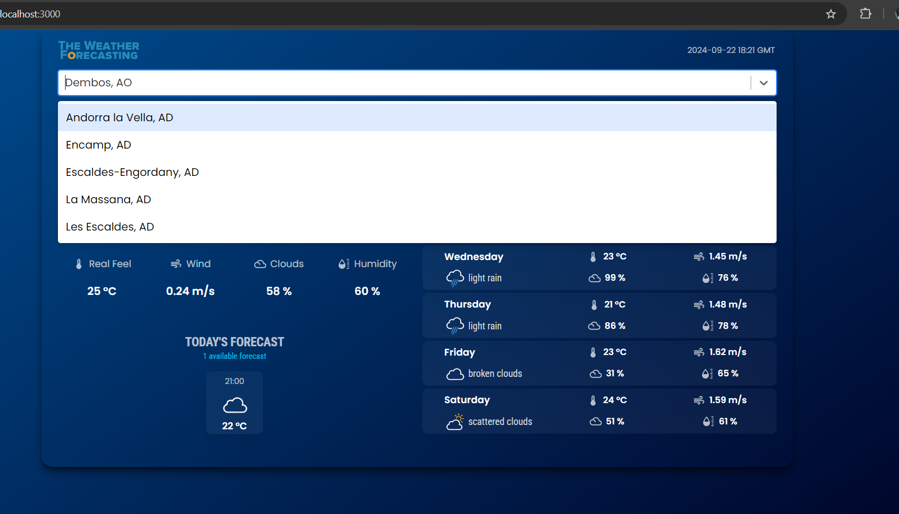

🌤️ Weather Forecast Application

Live Application Deployed Link: https://weather-forecasting-app-665q.vercel.app/

A simple, user-friendly React.js weather forecasting app that fetches real-time weather data from a public API. This project emphasizes reusable components, API integration, state management, and responsive design.

🚀 Features

    1.  Weather Data Display  🌎

- Displays the current weather for a default city (e.g., New York).
- Reusable components used to show:

  - City Name
  - Current Temperature
  - Weather Condition (e.g., sunny, rainy)
  - Weather Icon

  2.  City Search 🔍

- Users can search for weather information for different cities.
- Real-time weather data is fetched using a public weather API ,I have used: [OpenWeatherMap] https://openweathermap.org/
- Graceful error handling for scenarios like city not found or network issues.
- Custom-built input component featuring:

  - Search box with a dropdown modal listing cities for user selection.
  - No third-party libraries; everything built from scratch for flexibility.

    3.  Five-Day Weather Forecast 📅

- Below the current weather, a 5-day forecast is displayed.
- Each day shows:
  - Day of the week
  - High and Low temperatures
  - Weather Icon
- Reusable `ForecastCard` component for each day's weather.

  4.  Temperature Unit Conversion 🌡️

- Toggle between Celsius and Fahrenheit.
- Conversion logic is implemented manually without external libraries.
- React state manages the selected unit and updates temperatures accordingly.

  5.  Responsive UI & Styling 🎨

- Clean and visually appealing interface designed using CSS and React.js styling techniques.
- The application is fully responsive, adapting seamlessly to different screen sizes and orientations.
- Consistent styling across components ensures a unified look and feel.

Others

- Caching : Store the last searched city and its weather data for offline viewing.
- Pull-to-refresh : Easily update weather data by pulling down the screen.
- Performance Optimization : Explore lazy loading and API call optimizations for a smoother experience.

💻 Setup Instructions

Follow these steps to set up and run the Weather Forecast Application locally.

Prerequisites

- Node.js (>=12.x)
- npm (or yarn )

1.  Clone the Repository

git clone https://github.com/Sresthanand/weather-forecasting-app.git

cd weather-forecasting-app

2.  Install Dependencies

npm install

3.  Set up Environment Variables

- Create a `.env` file in the root of your project.
- Add the following line, replacing `your-weather-api-key` with your actual API key:

REACT_APP_WEATHER_API_KEY=your-weather-api-key

    4.  Run the Application

To start the app locally, run:

npm run start

This will start the app at `http://localhost:3000`.

    5.  Build for Production

To create a production build, run:

npm run build

This will generate optimized files in the `build` folder.

📖 How to Use the Application

1.  Search for a City :

- Use the search bar at the top of the page to find weather data for any city.
- As you type, a dropdown modal will list matching cities. Click on a city to view its weather.

2.  View Current Weather :

- The main page shows the current temperature, weather conditions, and an icon representing the weather for the selected city.

3.  Check the 5-Day Forecast :

- Below the current weather, you’ll find a 5-day forecast, showing the weather for the upcoming days.

4.  Switch Between Celsius and Fahrenheit :

- Use the toggle button to change between Celsius and Fahrenheit for all displayed temperatures.

📷 Screenshots

